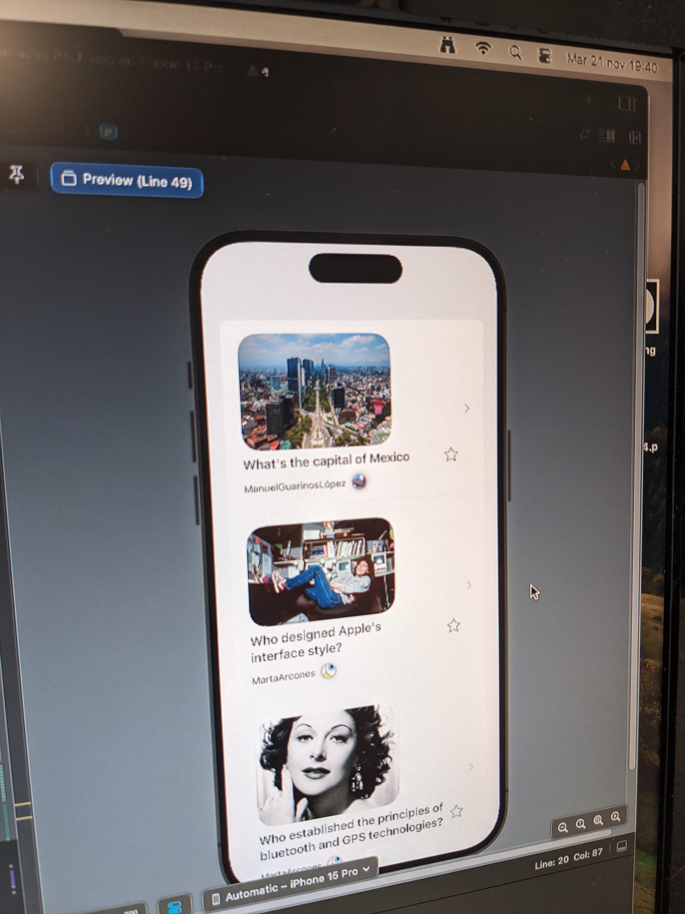

# 📱 MyQuizzes - Swift App

A native iOS quiz app built with **Swift** and **SwiftUI** as part of the **Mobile Application Development (MAD)** course at **ETSIT‑UPM** (2023–2024), focusing on modern UI design, state management, and smooth navigation flows.

---

## 🧠 Features

- Interactive quiz interface with multiple-choice questions  
- Real-time feedback and score tracking  
- Clean and responsive UI using SwiftUI  
- Modular architecture for easy extension and maintenance  
- Local JSON-based quiz data for quick prototyping

---

## 🛠️ Tech Stack

- **Language:** Swift  
- **Frameworks:** SwiftUI, Foundation  
- **Tools:** Xcode, Git

---

## 🚀 Getting Started

1. Clone the repository:
```bash
   git clone https://github.com/hernaangq/MyQuizzes-SwiftApp.git
````

2. Open the `.xcodeproj` or `.xcodeworkspace` in Xcode.

3. Build and run the app on a simulator or real device.

---


---

## 📸 Preview

| Quiz Interface           | Result Screen                |
| ------------------------ | ---------------------------- |
|  |  |


---

## 👤 Authors

* **Hernán García Quijano**: hernan.garcia.quijano@alumnos.upm.es
* **Laura Rueda García**: laura.rueda@alumnos.upm.es


